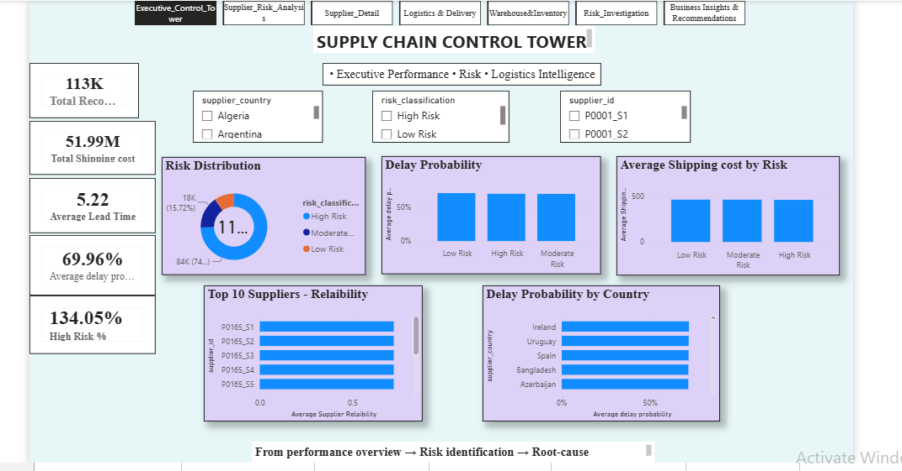
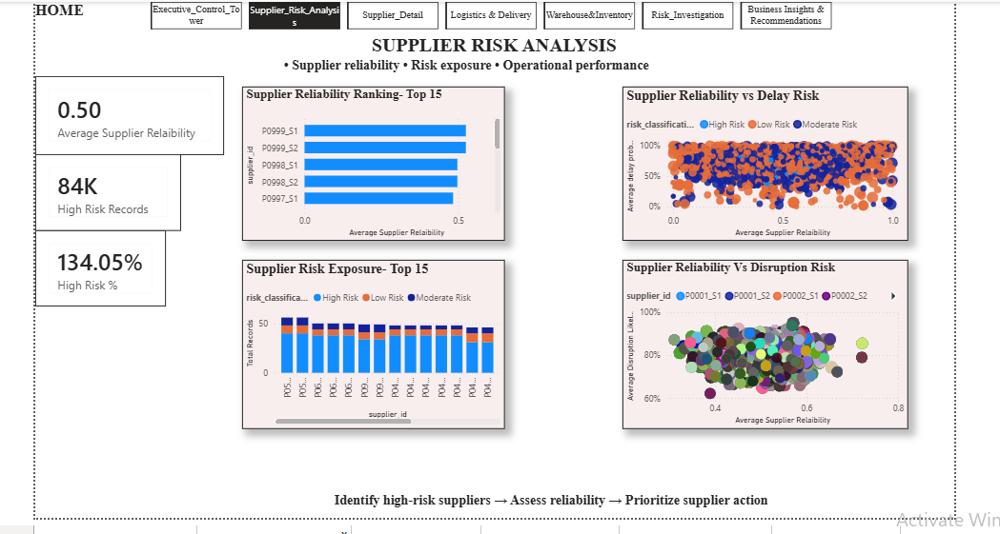
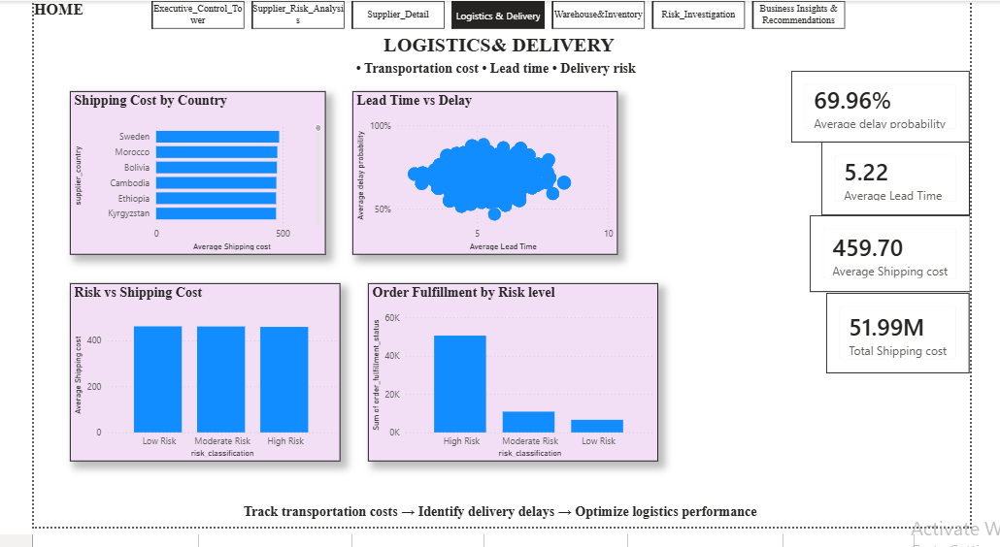
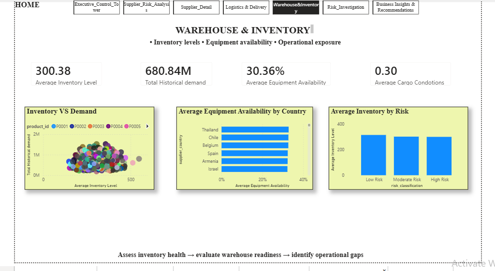
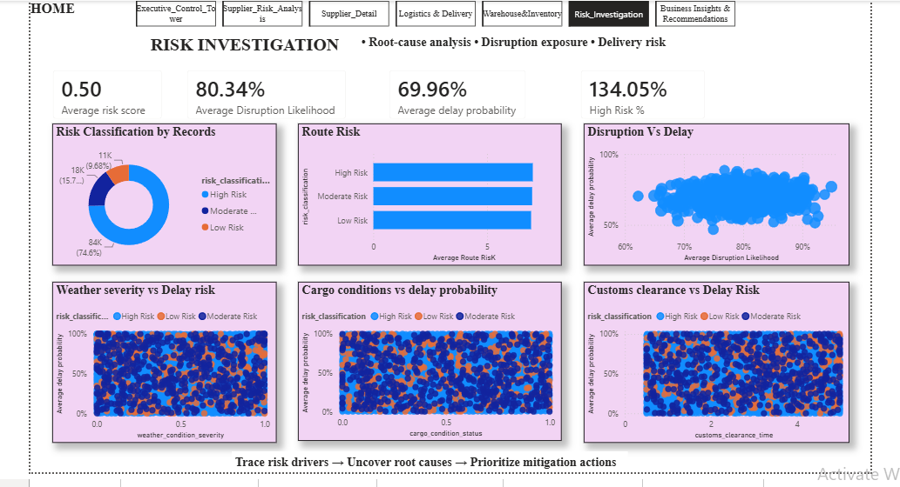
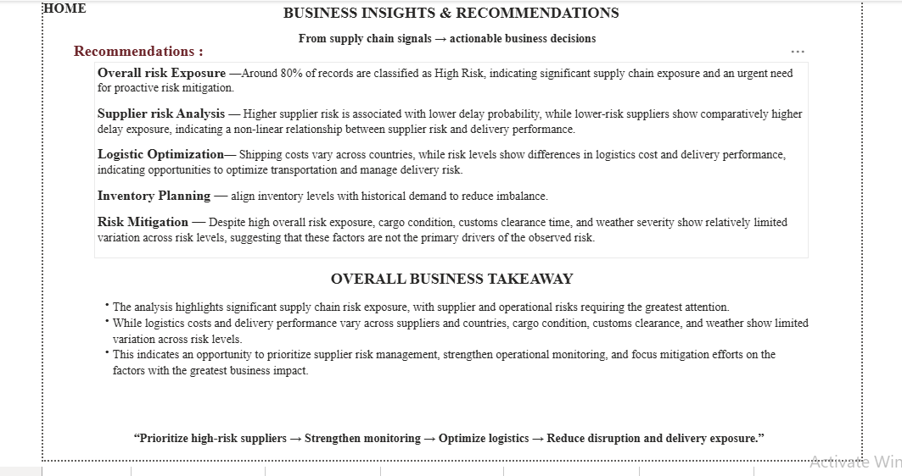

# 🚚 Supply Chain Control Tower | Power BI

### Transforming Supply Chain Data into Actionable Business Intelligence

An interactive **Supply Chain Control Tower** built in Power BI to monitor **supplier risk, logistics performance, delivery exposure, warehouse & inventory indicators, and operational risk drivers**.

The project transforms approximately **113K supply chain records** into an interactive management dashboard using **Power Query, DAX, Star Schema data modeling, KPI development, drill-through analysis, and business storytelling**.

---

## 📊 Dashboard Preview



---

## 🎯 Business Problem

Supply chain operations involve multiple interconnected risks across suppliers, transportation, inventory, delivery, and operational conditions.

Without a centralized analytical solution, decision-makers may struggle to:

* Identify high-risk suppliers
* Monitor delivery and delay exposure
* Understand logistics cost variations
* Evaluate inventory and warehouse conditions
* Investigate potential risk drivers
* Prioritize corrective actions

### 💡 Solution

This project provides a centralized **Supply Chain Control Tower** that brings these indicators together into one interactive analytical environment.

---

## 🚀 Project Objectives

* Monitor overall supply chain performance
* Identify high-risk exposure
* Evaluate supplier reliability
* Analyze logistics costs and delivery performance
* Assess inventory and warehouse indicators
* Investigate disruption and delay risk
* Compare performance across countries
* Enable supplier-level drill-through analysis
* Convert analytical findings into business recommendations

---

# 🛠️ Tech Stack

| Technology      | Application                           |
| --------------- | ------------------------------------- |
| **Power BI**    | Dashboard & interactive visualization |
| **Power Query** | Data cleaning & transformation        |
| **DAX**         | KPI & analytical calculations         |
| **CSV / Excel** | Source data                           |
| **Star Schema** | Data modeling                         |
| **GitHub**      | Portfolio & project documentation     |

---

# 🔄 End-to-End Analytics Workflow

```text
Raw Data
   ↓
Data Quality & Profiling
   ↓
Power Query
   ↓
Data Modeling
   ↓
Star Schema
   ↓
DAX Measures
   ↓
Interactive Dashboard
   ↓
Business Insights
   ↓
Recommendations
```

---

# 🧹 Data Preparation

The raw dataset was prepared and validated using **Power Query**.

### Data Quality Results

| Check                   | Result              |
| ----------------------- | ------------------- |
| Missing Values          | **0%**              |
| Data Errors             | **0%**              |
| Complete Duplicate Rows | **None Identified** |
| Data Types              | **Validated**       |
| Categorical Values      | **Reviewed**        |

Repeated `product_id` values were retained appropriately because a product can appear across multiple supply chain records.

---

# 📐 Data Model

The project follows a **Star Schema** designed for efficient analytical reporting.

### Fact Table

`Fact_SupplyChain`

### Dimension Tables

* `Dim_Product`
* `Dim_Supplier`
* `Dim_Country`

### Model Structure

```text
                 Dim_Product
                      │
                      │ 1 : *
                      ▼
Dim_Supplier ───► Fact_SupplyChain ◄─── Dim_Country
    1 : *                                  1 : *
```

### Relationship Design

* **Cardinality:** One-to-Many
* **Cross-filter:** Single direction
* **Date Table:** Not required because the source dataset contains no date field

---

# 📈 DAX & KPI Development

The dashboard contains **20 DAX measures** covering performance, risk, logistics, supplier, and operational indicators.

### Core KPIs

* Total Records
* Total Shipping Cost
* Average Lead Time
* Average Risk Score
* Average Delay Probability
* Average Delivery Deviation
* Average Disruption Likelihood
* Total Historical Demand
* Average Inventory Level
* Average Equipment Availability

### Risk Metrics

* High-Risk Records
* High-Risk %
* Low-Risk Records
* Moderate-Risk Records

### Operational Metrics

* Average Customs Clearance Time
* Average Shipping Cost
* Average Supplier Reliability
* Average Route Risk
* Average Weather Severity
* Average Cargo Condition

---

# 📊 Dashboard Overview

The report follows a structured management storyline:

**Monitor → Identify → Analyze → Investigate → Act**

---

## 01 | Executive Control Tower


### Focus

Management-level overview of supply chain performance and risk exposure.

### Key Analysis

* Overall KPIs
* Risk distribution
* Supplier reliability
* Delay probability
* Country-level delivery risk
* Shipping cost by risk

**Key Question:**
*What is the current overall supply chain performance and risk position?*

---

## 02 | Supplier Risk Analysis



### Focus

Supplier reliability, risk exposure, disruption likelihood, and delivery performance.

### Key Analysis

* Top supplier reliability
* High-risk supplier exposure
* Reliability vs delay risk
* Supplier risk distribution
* Reliability vs disruption risk

**Key Question:**
*Which suppliers require attention and how does supplier reliability relate to operational risk?*

---

## 03 | Logistics & Delivery



### Focus

Transportation costs, lead times, delivery risk, and fulfillment performance.

### Key Analysis

* Shipping cost by country
* Lead time vs delay probability
* Shipping cost by risk level
* Order fulfillment by risk

**Key Question:**
*Where are logistics costs and delivery risks concentrated?*

---

## 04 | Warehouse & Inventory



### Focus

Inventory health, historical demand, warehouse readiness, and operational indicators.

### Key Analysis

* Inventory vs demand
* Equipment availability by country
* Inventory by risk level
* Cargo condition

**Key Question:**
*Are warehouse and inventory indicators aligned with supply chain risk?*

---

## 05 | Risk Investigation



### Focus

Root-cause-oriented analysis of disruption and delivery risk.

### Key Analysis

* Risk classification
* Disruption vs delay
* Route risk
* Weather severity vs delay
* Cargo condition vs delay
* Customs clearance vs delay

**Key Question:**
*What operational factors are associated with supply chain risk and delivery exposure?*

---

## 06 | Business Insights & Recommendations



### Focus

Management-level interpretation of the complete analysis.

### Overall Business Takeaway

The analysis highlights significant supply chain risk exposure, with supplier and operational risks requiring the greatest attention. While logistics costs and delivery performance vary across suppliers and countries, cargo condition, customs clearance, and weather show limited variation across risk levels.

### Management Direction

> **Prioritize high-risk suppliers → Strengthen monitoring → Optimize logistics → Reduce disruption and delivery exposure**

---

# 🔍 Key Business Insights

### 🔴 Risk Exposure

A significant proportion of records are classified as high risk, indicating the need for proactive supply chain risk management.

### 👥 Supplier Risk

Supplier risk does not necessarily translate directly into higher delay probability, highlighting the importance of evaluating supplier reliability and operational risk independently.

### 🚚 Logistics

Shipping costs vary across countries, while risk levels show differences in logistics cost and delivery performance, creating opportunities for transportation optimization.

### 🏭 Warehouse & Operations

Despite high overall risk exposure, cargo condition, customs clearance time, and weather severity show relatively limited variation across risk levels, suggesting they are not the primary drivers of the observed risk.

---

# 💼 Business Recommendations

### 01 — Supplier Risk Management

* Prioritize high-risk suppliers
* Monitor supplier reliability continuously
* Develop supplier-specific mitigation strategies
* Review critical supplier dependencies

### 02 — Logistics Optimization

* Investigate high-cost countries and routes
* Monitor delivery-risk concentration
* Identify transportation cost optimization opportunities

### 03 — Operational Monitoring

* Track disruption likelihood and delay probability
* Establish early-warning indicators
* Strengthen risk-based operational monitoring

### 04 — Inventory Management

* Compare inventory against historical demand
* Monitor warehouse equipment availability
* Investigate inventory patterns associated with elevated risk

---

# ⚡ Interactive Features

### 🎛️ Dynamic Filters

Users can filter the dashboard using:

* Supplier Country
* Risk Classification
* Supplier ID

### 🔗 Cross-Filtering

Selecting a supplier, country, or risk category dynamically updates connected KPIs and visuals.

### 🔬 Supplier Drill-Through

A dedicated **Supplier Detail** page enables deeper supplier-level investigation.

### 🧭 Page Navigation

Users can move through the complete analytical story:

```text
Executive Control Tower
        ↓
Supplier Risk Analysis
        ↓
Logistics & Delivery
        ↓
Warehouse & Inventory
        ↓
Risk Investigation
        ↓
Business Insights & Recommendations
```

---

# 📁 Repository Contents

```text
supply-chain-control-tower-powerbi/
│
├── README.md
├── Project_Documentation.md
├── Supply_Chain_Control_Tower.pbix
│
├── 01_Executive_Control_Tower.png
├── 02_Supplier_Risk_Analysis.png
├── 03_Logistics_Delivery.png
├── 04_Warehouse_Inventory.png
├── 05_Risk_Investigation.png
└── 06_Business_Insights.png
```

---

# 🧠 Skills Demonstrated

**Power BI** · **DAX** · **Power Query** · **Data Modeling** · **Star Schema** · **Data Cleaning** · **KPI Development** · **Risk Analytics** · **Supply Chain Analytics** · **Business Intelligence** · **Data Visualization** · **Dashboard Design** · **Business Storytelling** · **Interactive Reporting**

---

# ⭐ Project Outcome

This project demonstrates an end-to-end **Data Analytics → Business Intelligence → Decision Support** workflow.

The final solution enables stakeholders to:

**Monitor → Identify → Investigate → Understand → Act**

by providing a centralized view of supply chain performance, supplier risk, logistics efficiency, inventory indicators, and operational risk.

---

## 👩‍💻 Portfolio Project

### **Supply Chain Control Tower — Power BI**

A business-focused analytics project demonstrating practical expertise in **Power BI development, DAX, Power Query, data modeling, risk analysis, dashboard design, and business storytelling.**
